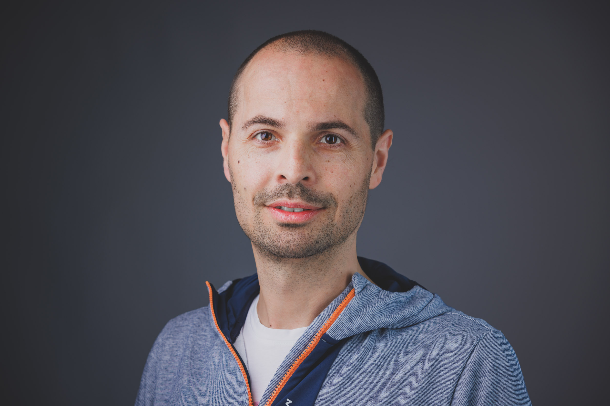
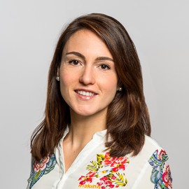
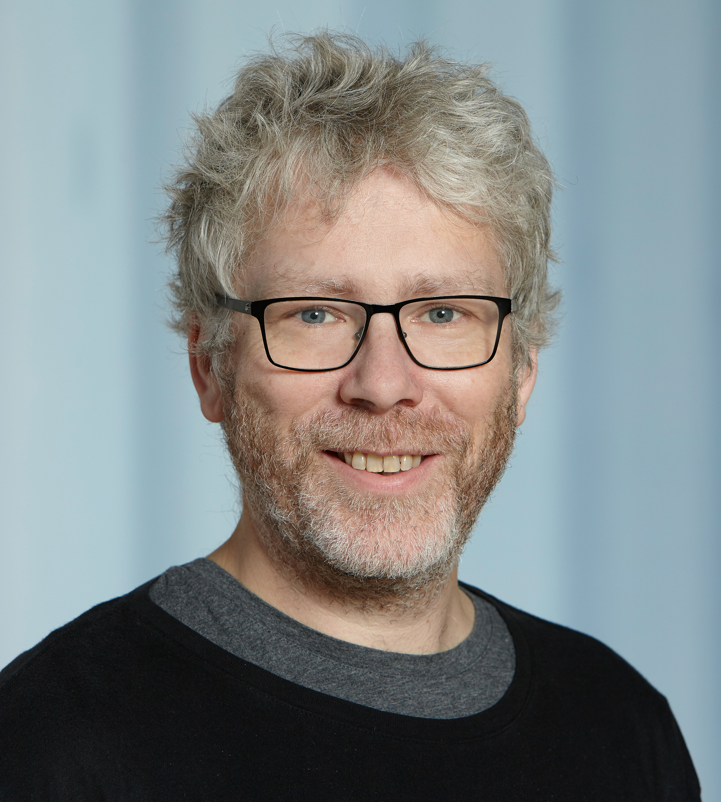

Welcome to the **Visual Localization and Mapping Workshop** organized at CVPR 2024 in Seattle, WA. 
{:target="_blank"}

* * *

# Topic {#topic}

Visual localization and mapping is a fundamental aspect of computer vision, with applications ranging from autonomous robotics to augmented reality. This workshop aims to bring together researchers, practitioners, and enthusiasts in the field to discuss the latest developments, challenges, and applications of visual localization and mapping. The workshop will provide a platform for sharing insights, fostering collaborations, and exploring the cutting-edge research that underpins this crucial area of computer vision.

Topics that will be covered in the workshop:

1. **SLAM (Simultaneous Localization and Mapping)**: Discuss the state-of-the-art SLAM algorithms, including both monocular, multi-sensor, and deep learning-based approaches.
2. **Visual Odometry**: Explore techniques for estimating the motion of a camera using visual data, and its applications in navigation and robotics.
3. **3D Reconstruction**: Present research on 3D scene reconstruction from images and discuss its role in mapping and localization.
4. **Semantic Mapping**: Highlight approaches that incorporate semantic information into mapping and localization tasks, enhancing scene understanding.
5. **Deep Learning for Visual Localization**: Discuss the integration of deep learning techniques, such as CNNs, Transformers, etc., in visual localization and mapping.
6. **Large-Scale Mapping**: Examine methods for handling large-scale environments and
their implications for real-world applications.
7. **Sensor Fusion**: Explore the fusion of visual data with other sensors, such as LiDAR,
IMU, and GNSS, for robust localization.
8. **Localization in Challenging Environments**: Address challenges such as low light and harsh weather conditions, dynamic scenes, and occlusions in localization and mapping.
9. **Applications**: Present real-world applications of visual localization and mapping, including robotics, autonomous vehicles, AR/VR, and more.
10. **Benchmark Datasets and Evaluation Metrics**: Discuss standardized datasets and evaluation criteria to measure the performance of localization and mapping algorithms.
11. **Future Directions**: Explore emerging trends and future research directions in the field, including the role of AI and machine learning.
12. **Industrial and Commercial Use Cases**: Showcase successful commercial implementations and case studies that demonstrate the practical value of visual localization and mapping.

* * *

# Schedule {#schedule}
- **June 17, 2024 ---** ViLMa Workshop @ CVPR 2024
- **Room**: Summit 327

<blockquote>
  
<strong>NOTE</strong>: Times are shown in <strong>Pacific Daylight Time</strong>. 
Please take this into account if you are joining the workshop virtually.

</blockquote>

<table>
  <tbody>
    <tr>
      <td>09:00 - 09:10</td>
      <td>Introduction to the Workshop</td>
    </tr>
    <tr>
      <td>09:10 - 09:55</td>
      <td><strong>Vincent Lepetit - Invited Keynote Talk 1</strong></td>
      <td><a href="assets/slides/vincent_lepetit_talk_vilma2024.pdf" target="blank">Slides</a></td>
    </tr>
    <tr>
      <td>09:55 - 10:40</td>
      <td><strong>Lukas von Stumberg  - Invited Keynote Talk 2</strong></td>
    </tr>
    <tr>
      <td>10:40 - 11:10</td>
      <td><em>Coffee Break (30 min)</em></td>
    </tr>
    <tr>
      <td>11:10 - 11:55</td>
      <td><strong>Jakob Engel - Invited Keynote Talk 3</strong></td>
    </tr>
    <tr>
      <td>11:55 - 13:05</td>
      <td><em>Lunch Break (70 min)</em></td>
    </tr>
    <tr>
      <td>13:05 - 13:50</td>
      <td><strong>Peter Kontschieder - Invited Keynote Talk 4</strong></td>
    </tr>
    <tr>
      <td>13:50 - 14:35</td>
      <td><strong>Laura Leal-Taixé - Invited Keynote Talk 5</strong></td>
    </tr>
    <tr>
      <td>14:35 - 15:05</td>
      <td><em>Coffee Break (30 min)</em></td>
    </tr>
    <tr>
      <td>15:05 - 15:50</td>
      <td><strong>Sebastian Scherer - Invited Keynote Talk 6</strong></td>
    </tr>
    <tr>
      <td>15:50 - 16:35</td>
      <td><strong>Marc Pollefeys - Invited Keynote Talk 7</strong></td>
    </tr>
    <tr>
      <td>16:35 - 17:10</td>
      <td>Panel Discussion</td>
    </tr>
    <tr>
      <td>17:10 - 17:20</td>
      <td>Closing Remarks</td>
    </tr>
  </tbody>
</table>

* * *

# Keynote Speakers {#speakers}

<figure>
    
    <b> <a href="https://theairlab.org/team/sebastian" target="_blank">Sebastian Scherer</a>
     Associate Research Professor Carnegie Mellon University</b>
</figure>

<figure>
    
    <b> <a href="https://scholar.google.com/citations?user=jBgFEukAAAAJ" target="_blank">Lukas von Stumberg</a>
     Computer Vision Software Engineer Valve Corporation</b>
</figure>

<figure>
    
    <b> <a href="https://vincentlepetit.github.io/" target="_blank">Vincent Lepetit</a>
     Professor ENPC ParisTech</b>
</figure>

<figure>
    
    <b> <a href="https://jakobengel.github.io/" target="_blank">Jakob Engel</a>
     Director of Research Meta Reality Labs</b>
</figure>

<figure>
    
    <b> <a href="https://scholar.google.com/citations?user=CxbDDRMAAAAJ" target="_blank">Peter Kontschieder</a>
     Director of Research Meta Reality Labs</b>
</figure>

<figure>
    
    <b> <a href="https://research.nvidia.com/labs/dvl/author/laura-leal-taixe/" target="_blank">Laura Leal-Taixé</a>
     Senior Research Manager NVIDIA</b>
</figure>

<figure>
    
    <b> <a href="https://cvg.ethz.ch/team/Prof-Dr-Marc-Pollefeys" target="_blank">Marc Pollefeys</a>
     Professor & Director Mixed Reality and AI Lab ETH & Microsoft</b>
</figure>

**Sebastian Scherer**
is an Associate Research Professor at the Robotics Institute (RI) at Carnegie Mellon University (CMU). His research focuses on enabling autonomy in challenging environments and previously led CMU’s entry to the SubT challenge. He and his team have shown several firsts for autonomy for flying robots and off-road driving. Dr. Scherer received his B.S. in Computer Science, M.S. and Ph.D. in Robotics from CMU in 2004, 2007, and 2010.  

**Lukas von Stumberg**
works at Valve Software on computer vision and machine learning. In 2023, he received his PhD at the Computer Vision Group, Technical University of Munich. His research interests are visual(-inertial) SLAM and robotics, combining traditional methods with deep learning. From 2018 until 2020, he was a Senior Computer Vision Engineer at the start-up Artisense, developing machine vision systems for robot and vehicle automation. He has published 11 conference and journal papers and 2 book chapters, which were cited 1300 times. Among them is the open-source SLAM system DM-VIO.

**Vincent Lepetit**
is a professor at ENPC ParisTech, France. Prior to this position, he was a full professor at the Institute for Computer Graphics and Vision, Graz University of Technology (TU Graz), Austria and before that, a senior researcher at CVLab, Ecole Polytechnique Federale de Lausanne (EPFL), Switzerland. His current research focuses on 3D scene understanding, especially at trying to reduce the supervision needed by a system to learn new 3D objects and new 3D environments. In 2020, he received with colleagues the Koenderick “test-of-time” award for “Brief: Binary Robust Independent Elementary Features”. He often serves as an area chair of major computer vision conferences (CVPR, ICCV, ECCV) and as an editor for the Pattern Analysis and Machine Intelligence (PAMI). He was awarded in 2023 an ERC Advanced Grant for the 'explorer' project on creating digital twins of large-scale sites.

**Jakob Engel**
is a Director of Research at Meta Reality labs, where he is leading egocentric machine perception research as part of Meta's Project Aria. He has 10+ years of experience working on SLAM, 3D scene understanding and user/environment interaction tracking, leading both research projects as well as shipping core localization technology into Meta's MR and VR product lines. Dr. Engel received his Ph.D. in Computer Science at the Computer Vision Group at the Technical University of Munich in 2016, where he pioneered direct methods for SLAM through DSO and LSD-SLAM.

**Peter Kontschieder**
received his PhD in 2013 from Graz University of Technology and is currently a Director (Research Science) at Meta Reality Labs in Zurich. His research interests include computer vision and machine learning, with particular focus on photorealistic 3D scene reconstruction, semantic scene understanding, image-based 3D modeling, and generative models for 3D synthesis. From 2013-2016 he was a postdoctoral researcher in the Machine Intelligence and Perception group at Microsoft Research in Cambridge (UK). In 2016 he joined Mapillary and founded Mapillary Research – Mapillary's research group focusing on applied research in Computer Vision and Machine Learning. With the acquisition of Mapillary in 2020, Peter and his team joined Facebook in Zurich. Peter received the Marr Prize in 2015 for his contribution of Deep Neural Decision Forests, joining deep learning with decision forests. He co-organized several tutorials and workshops on object recognition and robust computer vision at major conferences like CVPR, ECCV, and ICCV. He regularly published his research in high-impact conferences like ICCV, CVPR, ECCV, NeurIPS, and SIGGRAPH Asia. Peter received the Marr Prize in 2015 for his contribution of "Deep Neural Decision Forests". 

**Laura Leal-Taixé**
is a Senior Research Manager at NVIDIA and also an Adjunct Professor at the Technical University of Munich (TUM), leading the Dynamic Vision and Learning group. From 2018 until 2022, she was a tenure-track professor at TUM. Before that, she spent two years as a postdoctoral researcher at ETH Zurich, Switzerland, and a year as a senior postdoctoral researcher in the Computer Vision Group at the Technical University in Munich. She obtained her PhD from the Leibniz University of Hannover in Germany, spending a year as a visiting scholar at the University of Michigan, Ann Arbor, USA. She pursued B.Sc. and M.Sc. in Telecommunications Engineering at the Technical University of Catalonia (UPC) in her native city of Barcelona. She went to Boston, USA to do her Masters Thesis at Northeastern University with a fellowship from the Vodafone foundation. She is a recipient of the Sofja Kovalevskaja Award of 1.65 million euros in 2017, the Google Faculty Award in 2021, and the ERC Starting Grant in 2022.

**Marc Pollefeys**
is a Professor of Computer Science at ETH Zurich and the Director of the Microsoft Mixed Reality and AI Lab in Zurich where he works with a team of scientists and engineers to develop advanced perception capabilities for HoloLens and Mixed Reality. He was elected Fellow of the IEEE in 2012. He obtained his PhD from the KU Leuven in 1999 and was a professor at UNC Chapel Hill before joining ETH Zurich. He is best known for his work in 3D computer vision, having been the first to develop a software pipeline to automatically turn photographs into 3D models, but also works on robotics, graphics and machine learning problems. Other noteworthy projects he worked on are real-time 3D scanning with mobile devices, a real-time pipeline for 3D reconstruction of cities from vehicle mounted-cameras, camera-based self-driving cars and the first fully autonomous vision-based drone. Most recently his academic research has focused on combining 3D reconstruction with semantic scene understanding.

* * *

# Organizers {#organizers}

<figure>
    
    <b> <a href="https://cvg.cit.tum.de/members/cremers" target="_blank">Daniel Cremers</a>
     Professor Technical University of Munich</b>
</figure>

<figure>
    
    <b> <a href="https://dimadamen.github.io/" target="_blank">Dima Damen</a>
     Professor University of Bristol</b>
</figure>

<figure>
    
    <b> <a href="https://cvg.cit.tum.de/members/koestlel" target="_blank">Lukas Koestler</a>
     PhD Student Technical University of Munich</b>
</figure>

<figure>
    
    <b> <a href="https://srl.cit.tum.de/members/leuteneg" target="_blank">Stefan Leutenegger</a>
     Professor Technical University of Munich</b>
</figure>

<figure>
    
    <b> <a href="https://www.cs.toronto.edu/~urtasun/" target="_blank">Raquel Urtasun</a>
     CEO & Professor Waabi & University of Toronto</b>
</figure>

<figure>
    
    <b> <a href="https://pmwenzel.github.io/" target="_blank">Patrick Wenzel</a>
     AI Research Engineer Helsing</b>
</figure>

<figure>
    
    <b> <a href="https://www.niclas-zeller.de/" target="_blank">Niclas Zeller</a>
     Professor Karlsruhe University of Applied Sciences</b>
</figure>

