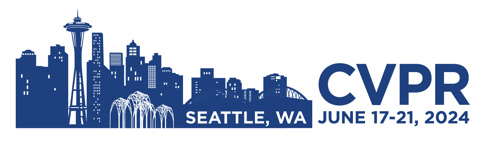
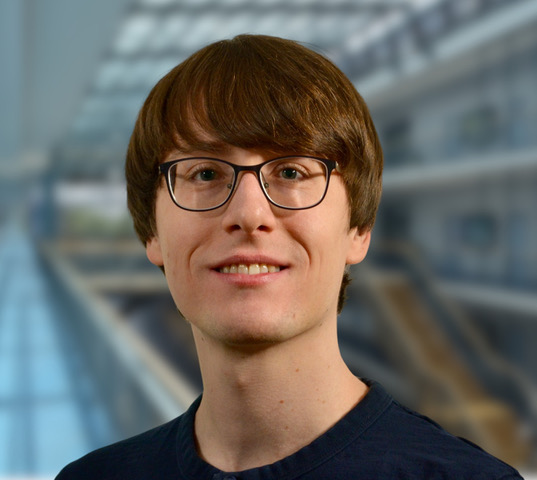
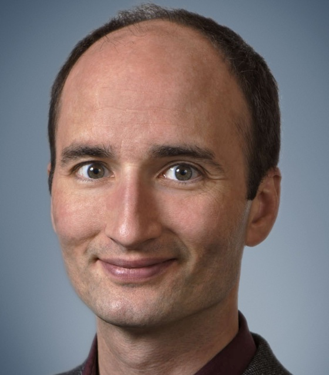
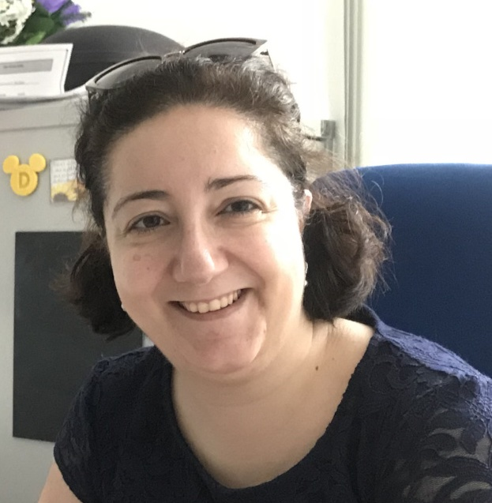
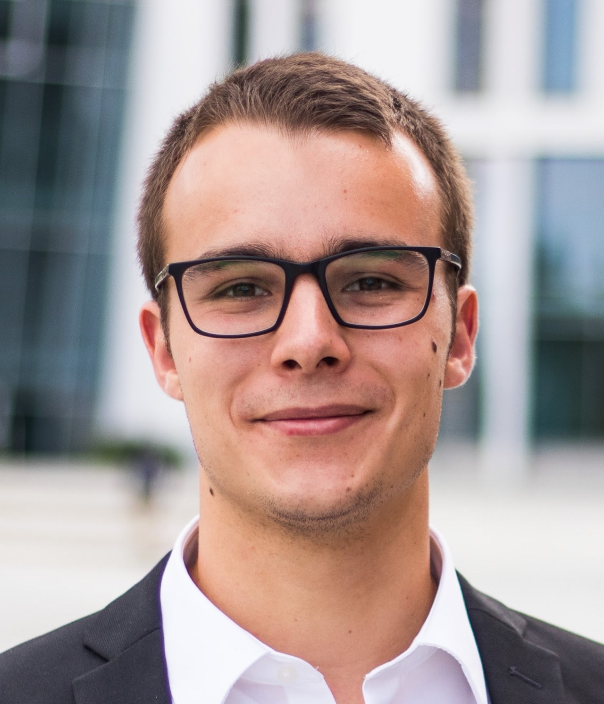
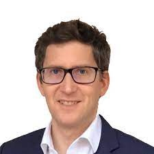
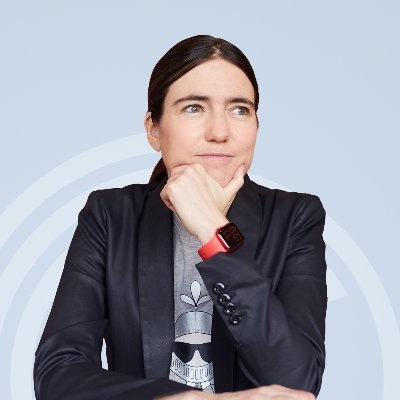
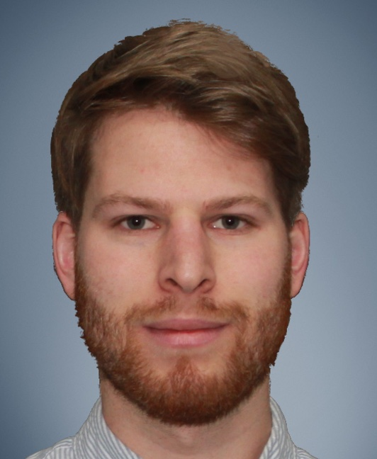
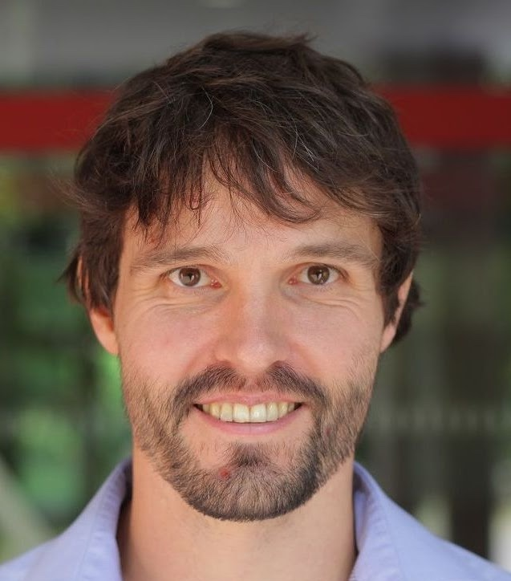

Welcome to the **Visual Localization and Mapping Workshop** organized at CVPR 2024 in Seattle, WA. 
{:target="_blank"}

* * *

# Topic {#topic}

Visual localization and mapping is a fundamental aspect of computer vision, with applications ranging from autonomous robotics to augmented reality. This workshop aims to bring together researchers, practitioners, and enthusiasts in the field to discuss the latest developments, challenges, and applications of visual localization and mapping. The workshop will provide a platform for sharing insights, fostering collaborations, and exploring the cutting-edge research that underpins this crucial area of computer vision.

Topics that will be covered in the workshop:

1. **SLAM (Simultaneous Localization and Mapping)**: Discuss the state-of-the-art SLAM algorithms, including both monocular, multi-sensor, and deep learning-based approaches.
2. **Visual Odometry**: Explore techniques for estimating the motion of a camera using visual data, and its applications in navigation and robotics.
3. **3D Reconstruction**: Present research on 3D scene reconstruction from images and discuss its role in mapping and localization.
4. **Semantic Mapping**: Highlight approaches that incorporate semantic information into mapping and localization tasks, enhancing scene understanding.
5. **Deep Learning for Visual Localization**: Discuss the integration of deep learning techniques, such as CNNs, Transformers, etc., in visual localization and mapping.
6. **Large-Scale Mapping**: Examine methods for handling large-scale environments and
their implications for real-world applications.
7. **Sensor Fusion**: Explore the fusion of visual data with other sensors, such as LiDAR,
IMU, and GNSS, for robust localization.
8. **Localization in Challenging Environments**: Address challenges such as low light and harsh weather conditions, dynamic scenes, and occlusions in localization and mapping.
9. **Applications**: Present real-world applications of visual localization and mapping, including robotics, autonomous vehicles, AR/VR, and more.
10. **Benchmark Datasets and Evaluation Metrics**: Discuss standardized datasets and evaluation criteria to measure the performance of localization and mapping algorithms.
11. **Future Directions**: Explore emerging trends and future research directions in the field, including the role of AI and machine learning.
12. **Industrial and Commercial Use Cases**: Showcase successful commercial implementations and case studies that demonstrate the practical value of visual localization and mapping.

* * *

# Schedule {#schedule}
- **June 17, 2024 ---** ViLMa Workshop @ CVPR 2024
- TBD

* * *

# Keynote Speakers {#speakers}

<figure>
    
    <b> <a href="https://theairlab.org/team/sebastian" target="_blank">Sebastian Scherer</a>
     Associate Research Professor Carnegie Mellon University</b>
</figure>

<figure>
    
    <b> <a href="https://scholar.google.com/citations?user=jBgFEukAAAAJ" target="_blank">Lukas von Stumberg</a>
     Computer Vision Software Engineer Valve Corporation</b>
</figure>

<figure>
    
    <b> <a href="https://vincentlepetit.github.io/" target="_blank">Vincent Lepetit</a>
     Professor ENPC ParisTech</b>
</figure>

**Sebastian Scherer**
is an Associate Research Professor at the Robotics Institute (RI) at Carnegie Mellon University (CMU). His research focuses on enabling autonomy in challenging environments and previously led CMU’s entry to the SubT challenge. He and his team have shown several firsts for autonomy for flying robots and off-road driving . Dr. Scherer received his B.S. in Computer Science, M.S. and Ph.D. in Robotics from CMU in 2004, 2007, and 2010.  

**Lukas von Stumberg**
works at Valve Software on computer vision and machine learning. In 2023, he received his PhD at the Computer Vision Group, Technical University of Munich. His research interests are visual(-inertial) SLAM and robotics, combining traditional methods with deep learning. From 2018 until 2020, he was a Senior Computer Vision Engineer at the start-up Artisense, developing machine vision systems for robot and vehicle automation. He has published 11 conference and journal papers and 2 book chapters, which were cited 1300 times. Among them is the open-source SLAM system DM-VIO.

**Vincent Lepetit**
is a professor at ENPC ParisTech, France. Prior to this position, he was a full professor at the Institute for Computer Graphics and Vision, Graz University of Technology (TU Graz), Austria and before that, a senior researcher at CVLab, Ecole Polytechnique Federale de Lausanne (EPFL), Switzerland. His current research focuses on 3D scene understanding, especially at trying to reduce the supervision needed by a system to learn new 3D objects and new 3D environments. In 2020, he received with colleagues the Koenderick “test-of-time” award for “Brief: Binary Robust Independent Elementary Features”. He often serves as an area chair of major computer vision conferences (CVPR, ICCV, ECCV) and as an editor for the Pattern Analysis and Machine Intelligence (PAMI). He was awarded in 2023 an ERC Advanced Grant for the 'explorer' project on creating digital twins of large-scale sites.

**Peter Kontschieder**

**Jakob Engel**

* * *

# Organizers {#organizers}

<figure>
    
    <b> <a href="https://cvg.cit.tum.de/members/cremers" target="_blank">Daniel Cremers</a>
     Professor Technical University of Munich</b>
</figure>

<figure>
    
    <b> <a href="https://dimadamen.github.io/" target="_blank">Dima Damen</a>
     Professor University of Bristol</b>
</figure>

<figure>
    
    <b> <a href="https://cvg.cit.tum.de/members/koestlel" target="_blank">Lukas Koestler</a>
     PhD Student Technical University of Munich</b>
</figure>

<figure>
    
    <b> <a href="https://srl.cit.tum.de/members/leuteneg" target="_blank">Stefan Leutenegger</a>
     Professor Technical University of Munich</b>
</figure>

<figure>
    
    <b> <a href="https://www.cs.toronto.edu/~urtasun/" target="_blank">Raquel Urtasun</a>
     CEO & Professor Waabi & University of Toronto</b>
</figure>

<figure>
    
    <b> <a href="https://pmwenzel.github.io/" target="_blank">Patrick Wenzel</a>
     AI Research Engineer Helsing</b>
</figure>

<figure>
    
    <b> <a href="https://www.niclas-zeller.de/" target="_blank">Niclas Zeller</a>
     Professor Karlsruhe University of Applied Sciences</b>
</figure>

